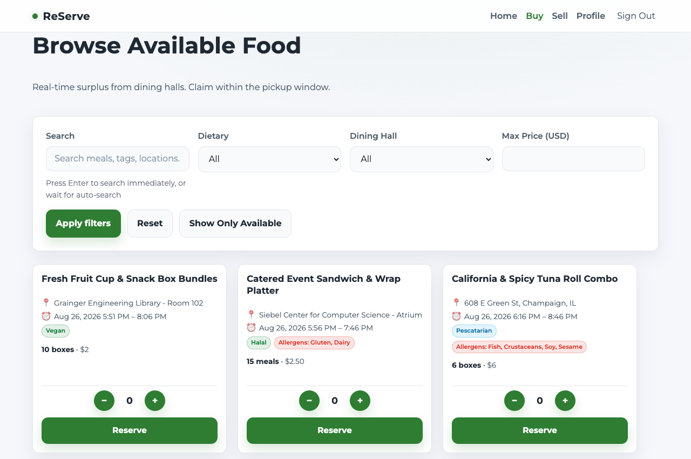
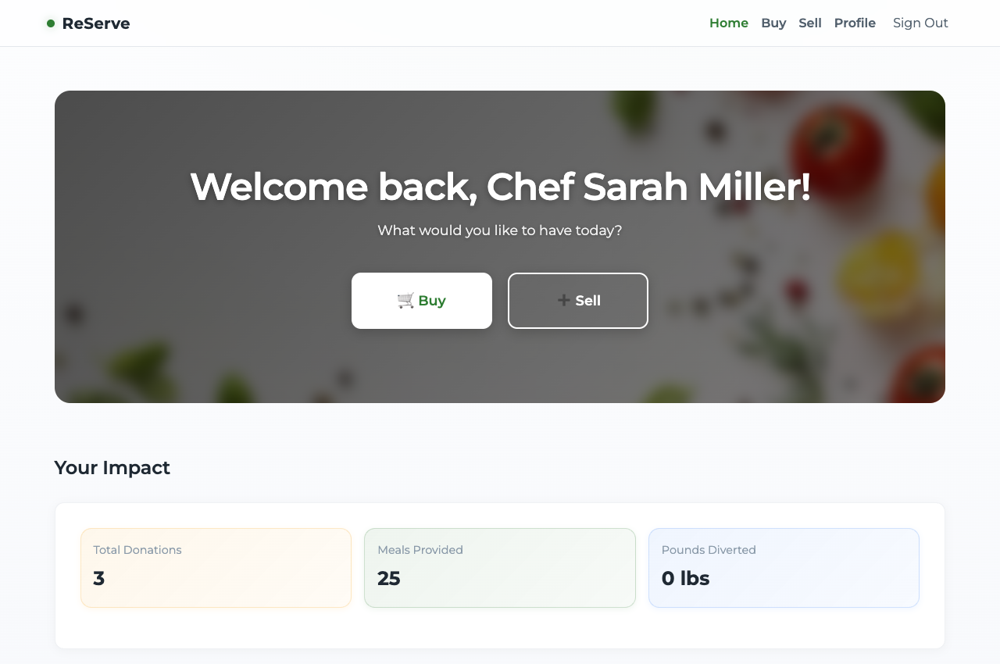
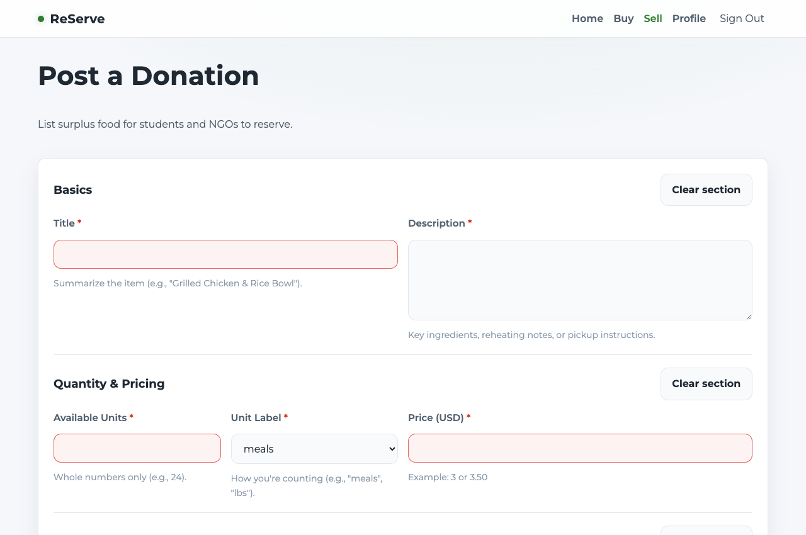
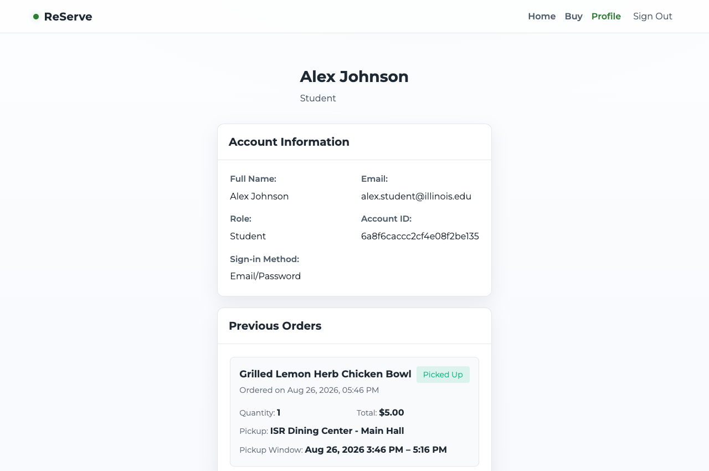

# 🌱 ReServe — Campus Food Waste Reduction & Redistribution Platform

> **Connecting campus dining halls, local eateries, and student organizations to reduce food waste and provide affordable meals across campus.**

[](https://react.dev/)
[](https://vitejs.dev/)
[](https://nodejs.org/)
[](https://expressjs.com/)
[](https://www.mongodb.com/)

---

## 📸 Application Screenshots

### 1. Surplus Food Marketplace (`/buy`)
Browse available surplus food listings in real time, filter by dining hall, dietary restrictions (Halal, Vegan, Gluten-Free, High Protein), or max price, and reserve meals within designated pickup windows.



---

### 2. Impact & Management Dashboard (`/home`)
Track campus-wide impact metrics including total meals provided, pounds of food diverted from waste, and fast navigation for buyers and sellers.



---

### 3. Post a Food Donation / Listing (`/sell`)
Dining hall managers and restaurant partners can quickly list surplus meals with available units, pricing, pickup windows, allergen tags, and instructions.



---

### 4. Student Profile & Orders (`/profile`)
Students and buyers can view their active reservations, past orders, and pickup verification details.



---

## ✨ Key Features

- **🛒 Real-Time Surplus Food Marketplace**: Dynamic browsing and reservation system with real-time unit counts and pickup window countdowns.
- **🏷️ Smart Dietary & Allergen Filters**: Filter by dining hall (*Ikenberry, ISR, FAR*), dietary preferences (*Vegetarian, Vegan, Pescatarian, High Protein, Halal, Gluten Free*), and price.
- **👥 Role-Based Access Control**:
  - **Dining Hall Staff / Sellers**: Post donations, manage active inventory, track donation metrics.
  - **Students / Buyers**: Discover surplus meals, place reservations, view order history.
- **⏰ Automated Expiration Management**: Built-in background cleanup job runs daily to mark unclaimed listings as expired once their pickup window passes.
- **📊 Impact Tracking**: Quantifies diverted food waste (meals saved and pounds diverted) to foster sustainability.
- **🔐 Secure Authentication**: JWT-based token authentication with optional Google OAuth 2.0 integration.

---

## 🛠️ Tech Stack

### Frontend
- **Framework**: React 19 + Vite 7
- **Routing**: React Router DOM v7
- **Styling**: Vanilla CSS (Custom Design System)
- **Auth Client**: `@react-oauth/google`

### Backend
- **Runtime**: Node.js (ES Modules)
- **Server Framework**: Express 5
- **Database / ODM**: MongoDB Atlas + Mongoose 8
- **Authentication & Security**: JSON Web Tokens (`jsonwebtoken`), `bcrypt`, `cors`

---

## 🚀 Getting Started

### Prerequisites
- **Node.js** (v18 or higher recommended)
- **npm** (comes bundled with Node.js)
- **MongoDB Atlas account** (or local MongoDB instance)

---

### 1. Clone the Repository
```bash
git clone https://github.com/adityakp15/ReServe.git
cd ReServe
```

---

### 2. Backend Configuration & Setup

1. **Install backend dependencies:**
   ```bash
   cd backend
   npm install
   ```

2. **Configure environment variables:**
   Create a `.env` file in the `backend/` directory (or copy from `.env.example`):
   ```bash
   cp .env.example .env
   ```

   Configure the variables inside `backend/.env`:
   ```env
   PORT=5001
   NODE_ENV=development
   JWT_SECRET=your_generated_jwt_secret_key
   MONGO_URI=mongodb+srv://<username>:<password>@cluster0.mongodb.net/ReServe?retryWrites=true&w=majority
   GOOGLE_CLIENT_ID=your_google_client_id.apps.googleusercontent.com # Optional
   FRONTEND_URL=http://localhost:5173
   ```

   > 💡 *To generate a secure `JWT_SECRET`, run:*
   > ```bash
   > node -e "console.log(require('crypto').randomBytes(32).toString('hex'))"
   > ```

3. **(Optional) Seed sample data:**
   Populate MongoDB with realistic campus dining listings, staff accounts, and sample orders:
   ```bash
   npm run seed
   ```

4. **Start the backend server:**
   ```bash
   npm start
   ```
   *Backend runs on [http://localhost:5001](http://localhost:5001)*

---

### 3. Frontend Configuration & Setup

1. **Install frontend dependencies:**
   ```bash
   cd ../frontend
   npm install
   ```

2. **Configure environment variables:**
   Create a `.env` file in the `frontend/` directory (or copy from `.env.example`):
   ```bash
   cp .env.example .env
   ```

   Configure `frontend/.env`:
   ```env
   VITE_API_URL=http://localhost:5001
   VITE_GOOGLE_CLIENT_ID=your_google_client_id.apps.googleusercontent.com # Optional
   ```

3. **Start the frontend development server:**
   ```bash
   npm run dev
   ```
   *Frontend opens at [http://localhost:5173](http://localhost:5173)*

---

## 🧪 Test Accounts

When the database is seeded (`npm run seed`), the following test accounts are ready for login:

> **Default Password for all test accounts:** `Password123!`

| Account Role | User Name | Email | Permissions |
|---|---|---|---|
| **Dining Staff** | Chef Sarah Miller | `sarah.miller@ikenberry.edu` | Post donations, manage inventory, view impact |
| **Dining Staff** | Marcus Chen | `marcus.chen@isr.edu` | Post donations, manage inventory, view impact |
| **Dining Staff** | Elena Rodriguez | `elena.rodriguez@far.edu` | Post donations, manage inventory, view impact |
| **Restaurant Partner** | David Kim | `david.kim@greenstreetgrill.com` | Post commercial food surplus |
| **RSO Coordinator** | Priya Sharma | `priya.sharma@illinois.edu` | Post event surplus catering |
| **Student** | Alex Johnson | `alex.student@illinois.edu` | Browse, filter, reserve meals, view orders |
| **Student** | Maya Patel | `maya.patel@illinois.edu` | Browse, filter, reserve meals, view orders |

---

## 📡 API Overview

| Method | Endpoint | Description | Auth Required |
|---|---|---|---|
| `GET` | `/api/health` | Service health & database connectivity check | No |
| `POST` | `/api/auth/signup` | Register a new student or staff user | No |
| `POST` | `/api/auth/login` | Authenticate with email and password | No |
| `POST` | `/api/auth/google` | Authenticate via Google OAuth token | No |
| `GET` | `/api/auth/me` | Fetch authenticated user profile | Yes |
| `GET` | `/api/listings` | Fetch active food listings (supports search, diet, hall filters) | No |
| `POST` | `/api/listings` | Create a new food surplus listing | Yes (Staff/Seller) |
| `GET` | `/api/listings/my` | Fetch listings created by current seller | Yes (Staff/Seller) |
| `POST` | `/api/orders` | Place a reservation order for a listing | Yes (Buyer) |
| `GET` | `/api/orders/my` | View buyer or seller order history | Yes |

---

## 📁 Repository Structure

```text
ReServe/
├── backend/
│   ├── index.js             # Express server setup, middleware, & routes
│   ├── seed.js              # Database seeder with sample users & listings
│   ├── jobs/
│   │   └── cleanup.js       # Background job for expired listings
│   ├── middleware/
│   │   └── auth.js          # JWT authentication and RBAC middleware
│   ├── models/
│   │   ├── User.js          # User schema & password hashing
│   │   ├── Listing.js       # Food listing schema & calculations
│   │   └── Order.js         # Order & reservation schema
│   └── routes/
│       ├── auth.js          # Auth endpoints (signup, login, Google)
│       ├── listings.js      # Marketplace & listing endpoints
│       └── orders.js        # Reservation & order endpoints
├── frontend/
│   ├── src/
│   │   ├── components/      # Navigation, ProtectedRoute, Footer, etc.
│   │   ├── pages/           # Home, Buy, Sell, Profile, Login, Signup
│   │   ├── styles/          # Modular CSS stylesheets
│   │   └── utils/           # API fetch helpers & auth storage
│   ├── index.html
│   └── vite.config.js
└── docs/
    └── screenshots/         # UI showcase images
```

---

## 🤝 Contributing

1. Fork the Project
2. Create your Feature Branch (`git checkout -b feature/AmazingFeature`)
3. Commit your Changes (`git commit -m 'Add some AmazingFeature'`)
4. Push to the Branch (`git push origin feature/AmazingFeature`)
5. Open a Pull Request
